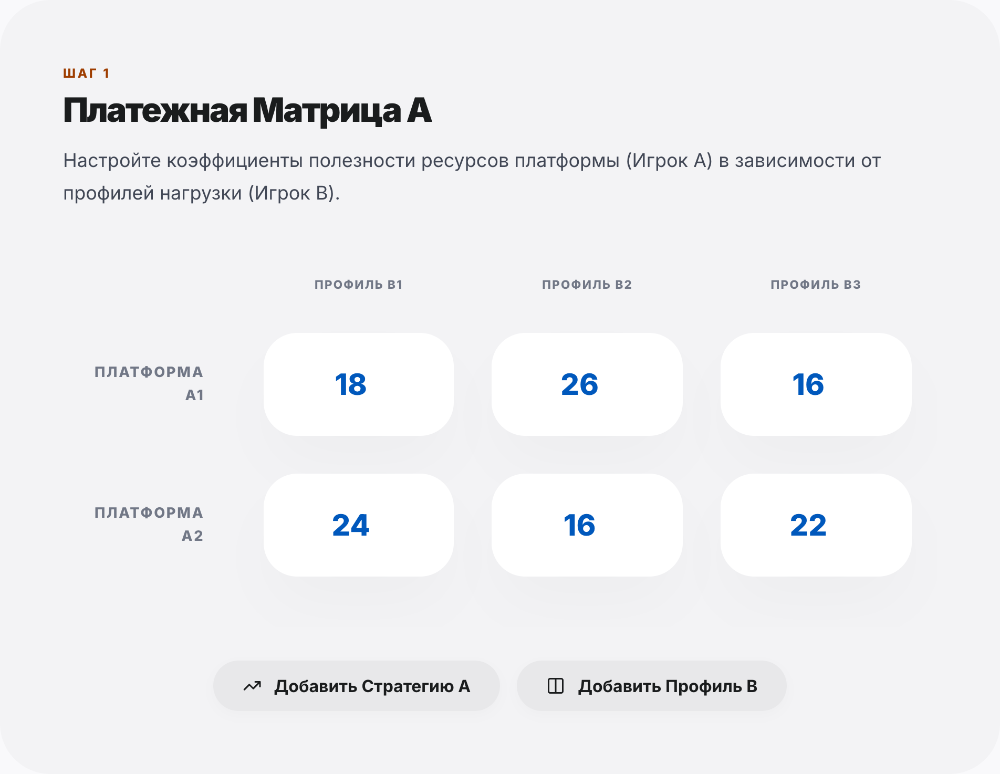
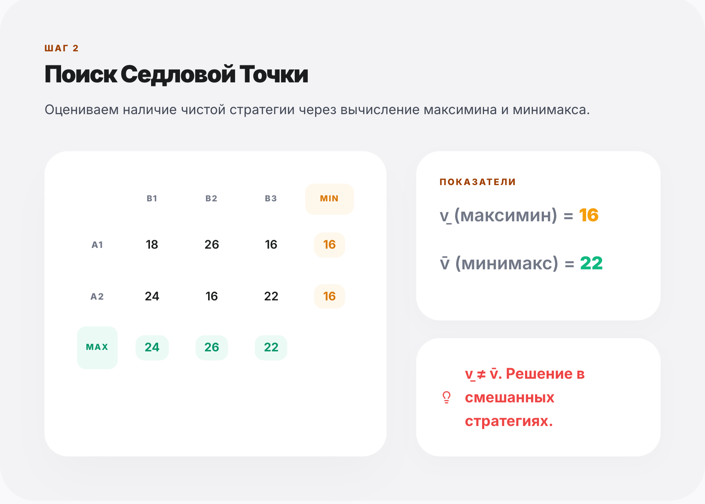
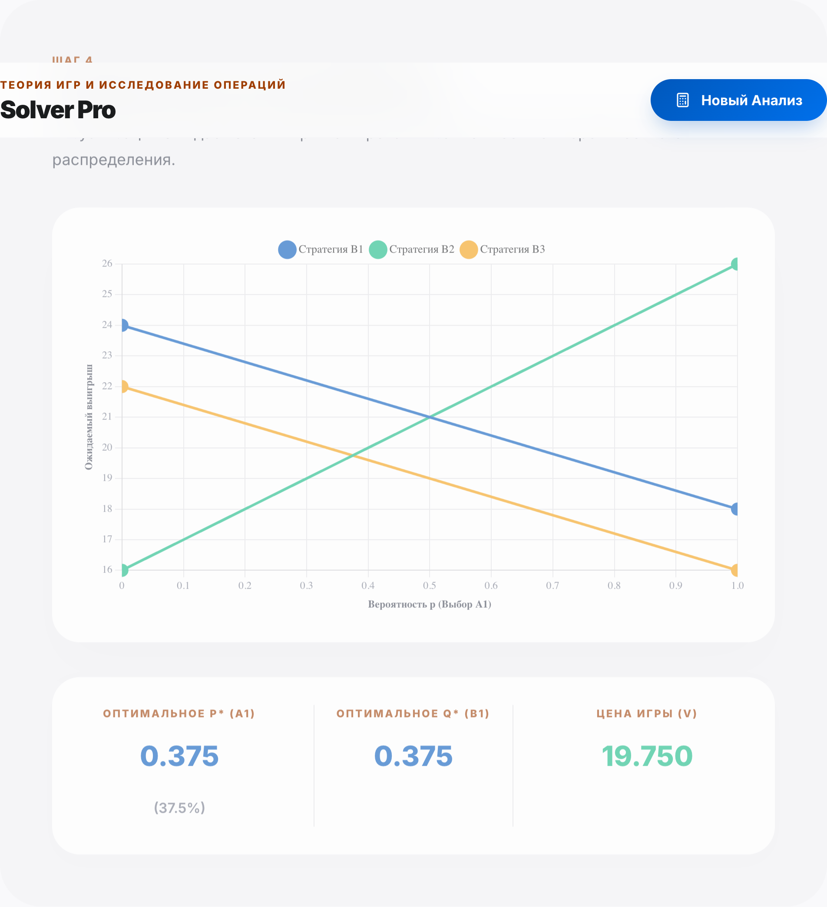
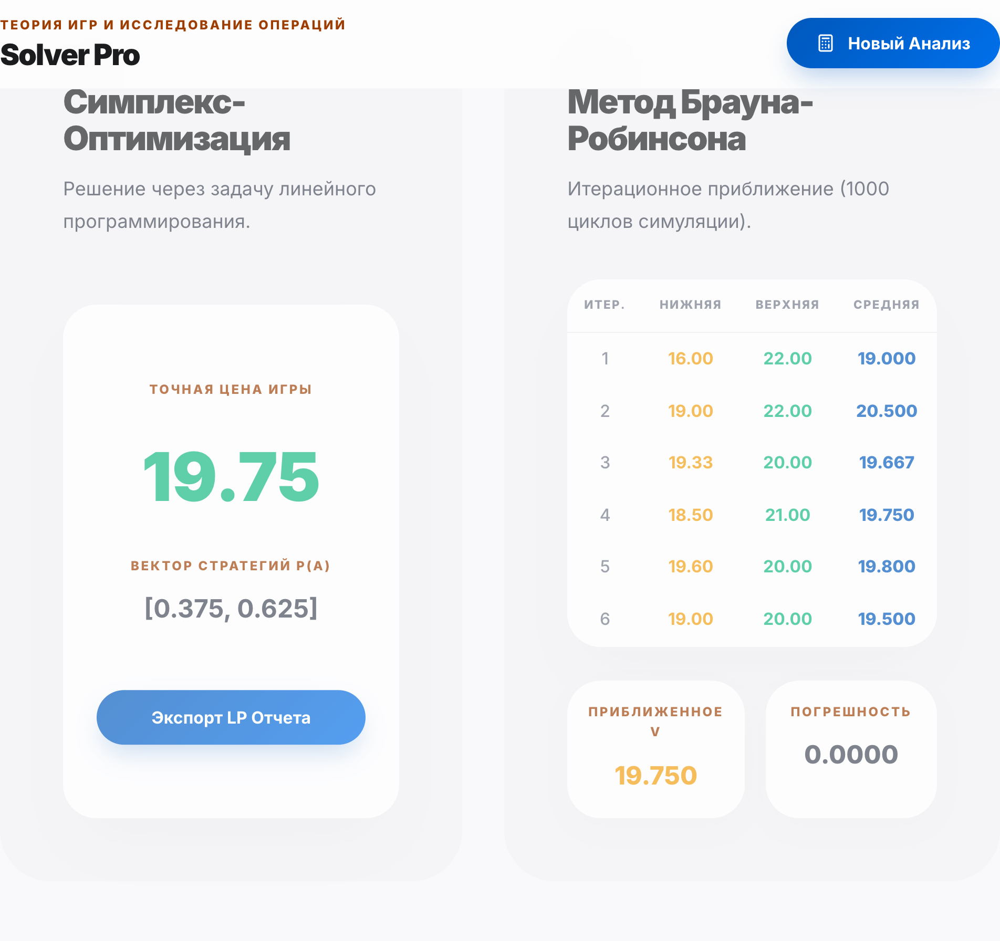

# Лабораторная работа: Теория Игр и Исследование Операций

## Вариант 17 — Распределение вычислительных ресурсов в облаке

---

## 📋 Описание задачи

Платформа для обучения специалистов по данным (**Игрок А**) масштабирует инфраструктуру GPU-ноутбуков и виртуальных сред под учебные задачи. Архитекторы платформы выбирают тип выделяемого пула:

| Стратегия Игрока А | Описание |
|---|---|
| **A1** — Пакетный пул (batch) | Зарезервированный пул под ночные задания по обучению моделей |
| **A2** — Потоковый пул (streaming) | Динамический пул для интерактивных Jupyter-сессий |

Активность студентов (**Игрок В**) реализуется по одному из трёх паттернов:

| Стратегия Игрока В | Описание |
|---|---|
| **B1** — Равномерная нагрузка | Стабильная нагрузка в течение дня |
| **B2** — Пиковая нагрузка | Всплеск перед дедлайнами |
| **B3** — Ночная нагрузка | Активность в период сдачи проектов |

### Платёжная матрица

Выигрыш платформы — коэффициент эффективности использования ресурсов (в у.е.):

|  | B1 (равномерная) | B2 (пиковая) | B3 (ночная) |
|---|:---:|:---:|:---:|
| **A1** (пакетный) | 18 | 26 | 16 |
| **A2** (потоковый) | 24 | 16 | 22 |

---

## 🧮 Методы решения

Приложение реализует полный цикл анализа матричной игры:

### 1. Поиск седловой точки
- Вычисление минимумов по строкам и максимумов по столбцам
- Определение нижней цены игры (максимин) и верхней цены (минимакс)
- Проверка наличия решения в чистых стратегиях

### 2. Редукция матрицы (доминирование)
- Итеративное исключение строго доминируемых строк и столбцов
- Упрощение пространства решений до минимальной матрицы

### 3. Графоаналитический метод
- Визуализация ожидаемого выигрыша Игрока А в зависимости от вероятности p
- Нахождение точки пересечения линий — оптимальной смешанной стратегии

### 4. Аналитическое решение (2×2)
- Алгебраическое решение для редуцированной матрицы 2×2
- Вычисление оптимальных вероятностей p* и q* и цены игры v

### 5. Симплекс-метод (ЛП)
- Решение задачи линейного программирования через симплекс-алгоритм
- Нахождение точной цены игры и оптимальных стратегий обоих игроков

### 6. Метод Брауна-Робинсона
- Итерационное приближение (1000 циклов)
- Таблица сходимости с нижней, верхней и средней оценками цены игры
- Оценка погрешности относительно точного решения

---

## 🖥️ Технологический стек

| Технология | Назначение |
|---|---|
| **React 19** | UI-фреймворк |
| **TypeScript** | Типизация |
| **Vite** | Сборка и dev-сервер |
| **Chart.js + react-chartjs-2** | Графики |
| **Framer Motion** | Анимации |
| **jsPDF + jspdf-autotable** | Генерация PDF-отчёта |
| **Lucide React** | Иконки |

---

## 🚀 Запуск проекта

### Требования
- Node.js >= 18
- npm >= 9

### Установка и запуск

```bash
# Клонирование репозитория
git clone https://github.com/<username>/laba_game_theory.git
cd laba_game_theory

# Установка зависимостей
npm install

# Запуск в режиме разработки
npm run dev
```

Приложение будет доступно по адресу: `http://localhost:5173`

### Сборка для продакшена

```bash
npm run build
```

Собранные файлы будут в папке `dist/`.

---

## 📐 Ход решения (Вариант 17)

### Шаг 1. Исходная платёжная матрица

```
         B1    B2    B3
A1  |   18  |  26  |  16  |
A2  |   24  |  16  |  22  |
```

### Шаг 2. Поиск седловой точки

- Минимумы по строкам: min(A1) = 16, min(A2) = 16
- Максимумы по столбцам: max(B1) = 24, max(B2) = 26, max(B3) = 22
- **Максимин (нижняя цена):** v̱ = max(16, 16) = **16**
- **Минимакс (верхняя цена):** v̄ = min(24, 26, 22) = **22**
- v̱ = 16 ≠ 22 = v̄ → **Седловой точки нет**, решение в смешанных стратегиях.

### Шаг 3. Анализ доминирования

Проверяем столбцы (стратегии Игрока В):
- B1: (18, 24), B2: (26, 16), B3: (16, 22)
- Столбец B2 не доминируется (26 > 18, но 16 < 24)
- Столбец B3: (16, 22) ≤ (18, 24) = B1? → 16 ≤ 18 и 22 ≤ 24 → **Да!**
- **Столбец B3 доминируется столбцом B1** (Игрок В минимизирует, предпочитает B1)

Редуцированная матрица:

```
         B1    B2
A1  |   18  |  26  |
A2  |   24  |  16  |
```

### Шаг 4. Графоаналитический метод

Для матрицы 2×2 строим линии ожидаемого выигрыша:
- При стратегии B1: E = 24 + (18 − 24)·p = 24 − 6p
- При стратегии B2: E = 16 + (26 − 16)·p = 16 + 10p

Точка пересечения (оптимум):
```
24 − 6p = 16 + 10p
8 = 16p
p* = 0.5
```

### Шаг 5. Аналитическое решение (2×2)

Для матрицы:
```
| a  b |   | 18  26 |
| c  d | = | 24  16 |
```

Формулы:
- p* = (d − c) / (a + d − b − c) = (16 − 24) / (18 + 16 − 26 − 24) = (−8) / (−16) = **0.500**
- q* = (d − b) / (a + d − b − c) = (16 − 26) / (−16) = (−10) / (−16) = **0.625**
- v = (a·d − b·c) / (a + d − b − c) = (18·16 − 26·24) / (−16) = (288 − 624) / (−16) = **21.000**

### Результат

| Параметр | Значение |
|---|---|
| Оптимальная стратегия Игрока А | p(A1) = 0.500, p(A2) = 0.500 |
| Оптимальная стратегия Игрока В | q(B1) = 0.625, q(B2) = 0.375 |
| Цена игры | **v = 21.000** |

### Шаг 6. Метод Брауна-Робинсона (верификация)

Итерационный метод за 1000 итераций сходится к значению ≈ 21.000, что подтверждает аналитическое решение.

| Итерация | v_min | v_max | v_avg |
|---|---|---|---|
| 1 | 18.00 | 18.00 | 18.000 |
| 2 | 17.00 | 21.00 | 19.000 |
| 3 | 18.67 | 21.33 | 20.000 |
| ... | ... | ... | ... |
| 1000 | ≈21.00 | ≈21.00 | ≈21.000 |

---

## 📊 Интерпретация результатов

**Для платформы (Игрок А):**
- Оптимальная стратегия — использовать пакетный и потоковый пулы с равной вероятностью (50/50)
- Это гарантирует средний коэффициент эффективности не менее 21 у.е. при любом поведении студентов

**Для студентов (Игрок В):**
- Наиболее вероятный паттерн в равновесии — равномерная нагрузка (62.5%) с периодическими пиками перед дедлайнами (37.5%)
- Ночная нагрузка (B3) является доминируемой стратегией и исключается из оптимального поведения

---

## 📸 Скриншоты интерфейса

### Главный экран с платёжной матрицей


### Поиск седловой точки


### Редукция матрицы (доминирование)


### Графоаналитический метод


### Симплекс-метод и метод Брауна-Робинсона


---

## 📄 Экспорт результатов

Приложение поддерживает два формата экспорта:

1. **PDF-отчёт** — полный отчёт со всеми шагами решения, таблицами и графиком (кнопка «Загрузить PDF»)
2. **JSON** — структурированные данные для дальнейшей обработки (кнопка «Экспорт LP Отчета»)

---

## 📁 Структура проекта

```
laba_game_theory/
├── public/                  # Статические ресурсы
├── src/
│   ├── math/
│   │   └── gameTheory.ts    # Математическое ядро (все алгоритмы)
│   ├── App.tsx              # Главный компонент (UI + логика)
│   ├── App.css              # Стили компонентов
│   ├── index.css            # Глобальные стили и дизайн-система
│   ├── reportEngine.ts      # Генерация PDF-отчёта
│   └── main.tsx             # Точка входа
├── index.html               # HTML-шаблон
├── package.json             # Зависимости и скрипты
├── vite.config.ts           # Конфигурация Vite
└── tsconfig.json            # Конфигурация TypeScript
```

---

## 👤 Автор

- **Вариант:** 17
- **Дисциплина:** Теория Игр и Исследование Операций

---

## 📝 Лицензия

Учебный проект. Все права защищены.
